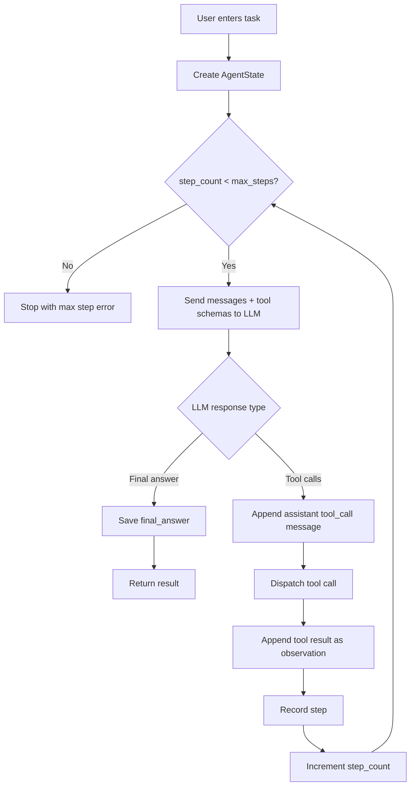
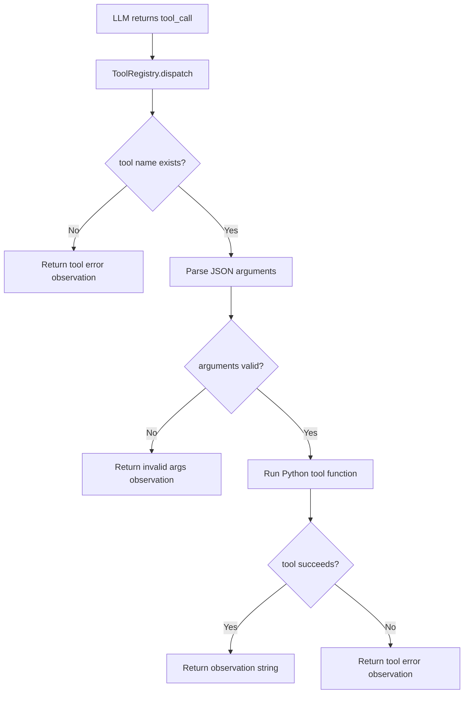

# Minimal ReAct File Agent Design

## Goal

Build a small teaching-oriented ReAct agent from scratch.

The first version is not a full coding assistant. It is a minimal autonomous
loop that can inspect and edit files inside this project directory by using
LLM tool calls.

The main learning goal is to understand the agent loop:

```text
observe -> reason -> act -> observe result -> repeat -> final answer
```

## Scope

Version 1 includes:

- OpenRouter chat completion through the OpenAI-compatible API.
- A ReAct-style loop controlled by Python.
- Short-term task memory through the message history.
- A small file-tool registry.
- A command-line interface.
- A test fixture based on a "case files" investigation task.

Version 1 does not include:

- Bash or shell execution.
- Long-term memory.
- Web search.
- Streaming.
- Planner-executor separation.
- A plugin system.

## High-Level Architecture

```text
CLI
 |
 v
Agent.run(task)
 |
 v
AgentState
 |
 v
ReAct Loop
 |
 +--> LLM Decision
 |      |
 |      +--> final answer -> stop
 |      |
 |      +--> tool calls
 |
 +--> Tool Registry
 |      |
 |      +--> list_files
 |      +--> read_file
 |      +--> edit_file
 |
 +--> Observation
 |
 +--> update AgentState
 |
 +--> next loop
```

The LLM decides what to do next. Python owns the control loop, state,
tool execution, safety checks, and stop conditions.

## Main Flow



## Tool Call Flow



Tool errors become observations. They do not crash the agent loop by default.
The LLM can decide what to do after seeing the error.

## State Model

`AgentState` stores all runtime state for one task.

```python
@dataclass
class AgentState:
    task: str
    messages: list
    steps: list
    final_answer: str | None
    step_count: int
    max_steps: int
    done: bool
```

Field meanings:

- `task`: the original user task.
- `messages`: OpenAI/OpenRouter message history. This is short-term memory.
- `steps`: structured trace for teaching and debugging.
- `final_answer`: final response when the agent is done.
- `step_count`: number of completed ReAct loop iterations.
- `max_steps`: hard stop to prevent infinite loops.
- `done`: whether the agent has finished.

Each structured step should look like:

```python
{
    "step": 1,
    "tool": "read_file",
    "arguments": {"path": "case_files/report.md"},
    "observation": "..."
}
```

## Message Design

The initial messages should contain:

```text
system:
You are a ReAct file agent. Solve the user's task by repeatedly observing,
reasoning, and acting with tools. Use tools when you need to inspect or edit
project files. When the task is complete, answer directly.

user:
{task}
```

The message history then follows the OpenAI tool-calling pattern:

```text
user task
assistant tool_call
tool result
assistant tool_call
tool result
assistant final answer
```

## ReAct Loop Policy

Every loop iteration asks the LLM for the next decision.

The LLM may either:

- return a final answer, or
- request one or more tool calls.

Python is responsible for:

- preserving message history,
- enforcing `max_steps`,
- executing tools,
- protecting file boundaries,
- recording each step,
- printing a readable trace.

The LLM is responsible for:

- deciding which files to inspect,
- deciding whether a file edit is needed,
- choosing tool arguments,
- interpreting tool observations,
- deciding when the task is complete.

## Tools

Version 1 has three tools.

### `list_files(path: str)`

List files under a project-relative directory.

Rules:

- `path` must be relative.
- The resolved path must stay inside the project root.
- The tool should return a readable list of names.

### `read_file(path: str)`

Read a project-relative text file.

Rules:

- `path` must be relative.
- The resolved path must stay inside the project root.
- Directories cannot be read as files.
- File errors are returned as tool error observations.

### `edit_file(path: str, old_text: str, new_text: str)`

Replace exact text in a project-relative text file.

Rules:

- `path` must be relative.
- The resolved path must stay inside the project root.
- `old_text` must appear exactly once.
- If `old_text` is missing or ambiguous, do not edit.
- Return a concise success or error observation.

## Tool Registry

`ToolRegistry` owns schemas and dispatch.

```python
class ToolRegistry:
    def schemas(self) -> list[dict]:
        ...

    def dispatch(self, tool_call) -> str:
        ...

    def register(self, name, schema, func):
        ...
```

The registry separates:

- tool schema shown to the LLM,
- Python function used locally,
- argument parsing and error handling.

## Config

`config.json` should contain:

```json
{
  "model": "your/openrouter-model",
  "temperature": 0.2,
  "max_steps": 20
}
```

The API key must come from the environment:

```text
OPENROUTER_API_KEY
```

The API key should never be stored in `config.json`.

## Proposed Files

```text
agent.py
tools.py
config.json
requirements.txt
case_files/
```

Responsibilities:

- `agent.py`: CLI, `Agent`, `AgentState`, OpenRouter client, ReAct loop.
- `tools.py`: tool schemas, file tools, `ToolRegistry`.
- `config.json`: model and loop settings.
- `requirements.txt`: Python dependencies.
- `case_files/`: multi-step investigation fixture.

## Test Fixture Idea

The first teaching fixture is a small "case files" investigation.

Example task:

```text
Please investigate the files in case_files, find the wrong conclusion in
report.md, fix the report using the evidence, and explain the final reasoning.
```

Expected behavior:

```text
1. list_files("case_files")
2. read_file("case_files/briefing.txt")
3. read_file("case_files/report.md")
4. read witness and evidence files
5. identify contradiction
6. edit_file("case_files/report.md", ...)
7. read_file("case_files/report.md") to verify
8. return final answer
```

The fixture should force multiple observations before editing. The answer
should not be obvious from a single file.

## Teaching Implementation Order

Implement one module or concept at a time:

1. Write `tools.py` with safe path handling and file tools.
2. Add `ToolRegistry` and schemas.
3. Create `case_files` fixture.
4. Write config loading and OpenRouter client setup.
5. Implement `AgentState`.
6. Implement one-step LLM decision.
7. Implement the full ReAct loop.
8. Add CLI trace printing.
9. Run the fixture task and inspect the trace.

